# Лабораторная работа №1: Работа с сокетами

**Студент:** Бородин Максим  
**Группа:** K3341  
**Дата:** 24 сентября 2025 г.

## Цель работы

Изучить основы работы с сокетами в Python, реализовать клиент-серверные приложения с использованием протоколов UDP и TCP, создать простой HTTP-сервер и многопользовательский чат.
 
Описание заданий: [Лабораторная №1 — задания](https://tonikx.github.io/web_development_book/labs/1_working_with_sockets/tasks/).

## Задание 1: UDP-сокеты

### Условие
Реализовать клиентскую и серверную часть приложения. Клиент отправляет серверу сообщение «Hello, server», и оно должно отобразиться на стороне сервера. В ответ сервер отправляет клиенту сообщение «Hello, client», которое должно отобразиться у клиента.

**Требования:**
- Использовать библиотеку `socket`
- Реализовать с помощью протокола UDP

### Реализация

#### Серверная часть (server.py)
```python
import socket

s = socket.socket(socket.AF_INET, socket.SOCK_DGRAM)
s.bind(('localhost', 8080))
data, addr = s.recvfrom(1024)
s.sendto(b'Hello, client', addr)
```
Полный код: `Lr1/ex1/server.py`

#### Клиентская часть (client.py)
```python
import socket

with socket.socket(socket.AF_INET, socket.SOCK_DGRAM) as s:
    s.sendto(b'Hello, server', ('localhost', 8080))
    print(s.recvfrom(1024)[0].decode())
```
Полный код: `Lr1/ex1/client.py`

### Результат работы
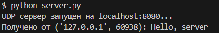
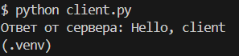

---

## Задание 2: TCP-сокеты для математических операций

### Условие
Реализовать клиентскую и серверную часть приложения. Клиент запрашивает выполнение математической операции, параметры которой вводятся с клавиатуры. Сервер обрабатывает данные и возвращает результат клиенту.

**Варианты операций:**
1. Теорема Пифагора
2. Решение квадратного уравнения  
3. Поиск площади трапеции
4. Поиск площади параллелограмма

**Требования:**
- Использовать библиотеку `socket`
- Реализовать с помощью протокола TCP

### Реализация

#### Серверная часть (server.py)
```python
import socket, math

def handle_request(line: str) -> str:
    op, *args = line.split()
    if op == 'PYTH':
        a, b = map(float, args)
        return f"Гипотенуза: {math.hypot(a, b):.2f}"
    # ... QUAD / TRAP / PARA ...

s = socket.socket(socket.AF_INET, socket.SOCK_STREAM)
s.bind(('localhost', 8080)); s.listen(5)
conn, _ = s.accept()
resp = handle_request(conn.recv(1024).decode())
conn.sendall((resp + '\n').encode('utf-8'))
```
Полный код: `Lr1/ex2/server.py`

#### Клиентская часть (client.py)
```python
import socket

with socket.socket(socket.AF_INET, socket.SOCK_STREAM) as s:
    s.connect(('localhost', 8080))
    s.sendall(b'PYTH 3 4\n')
    print(s.recv(1024).decode().strip())
```
Полный код: `Lr1/ex2/client.py`

### Результат работы
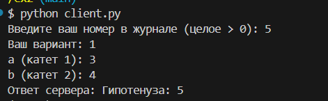
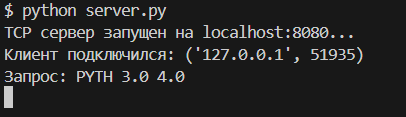

---

## Задание 3: HTTP-сервер

### Условие
Реализовать серверную часть приложения. Клиент подключается к серверу, и в ответ получает HTTP-сообщение, содержащее HTML-страницу, которая сервер подгружает из файла `index.html`.

**Требования:**
- Использовать библиотеку `socket`

### Реализация

#### Серверная часть (server.py)
```python
import socket
from pathlib import Path

HOST, PORT = "0.0.0.0", 8080
FILE = Path("Index.html")

def build_response(body: bytes) -> bytes:
    head = ("HTTP/1.1 200 OK\r\n"
            "Content-Type: text/html; charset=utf-8\r\n"
            f"Content-Length: {len(body)}\r\n\r\n").encode("utf-8")
    return head + body

srv = socket.socket(socket.AF_INET, socket.SOCK_STREAM)
srv.bind((HOST, PORT)); srv.listen(5)
conn, _ = srv.accept(); _ = conn.recv(1024)
conn.sendall(build_response(FILE.read_bytes()))
```
Полный код: `Lr1/ex3/server.py`

#### HTML-страница (Index.html)
```html
<!doctype html><html><body><p>Hello there</p></body></html>
```
Полный код: `Lr1/ex3/Index.html`

### Результат работы
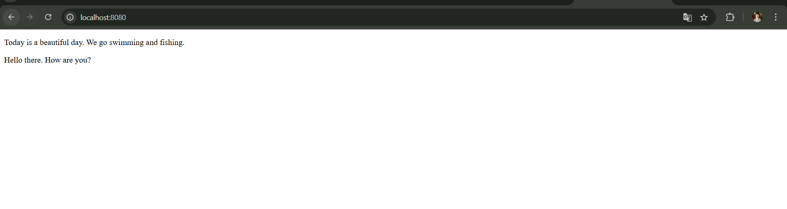
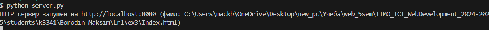

---

## Задание 4: Многопользовательский чат

### Условие
Реализовать многопользовательский чат с использованием библиотеки `threading`.

**Требования:**
- Использовать библиотеку `socket`
- Использовать библиотеку `threading`
- Протокол TCP

### Реализация

#### Серверная часть (chat_server.py)
```python
import socket, threading

HOST, PORT = '0.0.0.0', 9090
clients, lock = set(), threading.Lock()

def broadcast(text: str, exclude=None):
    with lock:
        for c in list(clients):
            if c is not exclude:
                try: c.sendall(text.encode('utf-8'))
                except OSError: clients.discard(c)

def handle(conn):
    name = conn.recv(1024).decode().strip()
    with lock: clients.add(conn)
    broadcast(f"* {name} joined\n", exclude=conn)
    # ... чтение строк и broadcast ...
```
Полный код: `Lr1/ex4/chat_server.py`

#### Клиентская часть (chat_client.py)
```python
import socket, threading

sock = socket.socket(socket.AF_INET, socket.SOCK_STREAM)
sock.connect(('127.0.0.1', 9090))

def recv_loop():
    while True:
        print(sock.recv(1024).decode(), end='')

threading.Thread(target=recv_loop, daemon=True).start()
sock.sendall((input('nick: ') + '\\n').encode())
while True:
    sock.sendall((input() + '\\n').encode())
```
Полный код: `Lr1/ex4/chat_client.py`

### Результат работы
вид от разных участников
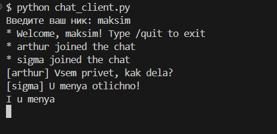
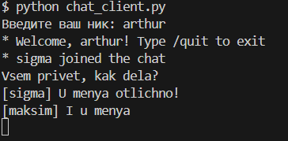
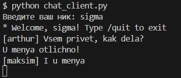
---

## Задание 5: Веб-сервер для обработки GET и POST запросов

### Условие
Написать простой веб-сервер для обработки GET и POST HTTP-запросов с помощью библиотеки `socket` в Python.

**Функциональность:**
1. Принять и записать информацию о дисциплине и оценке по дисциплине
2. Отдать информацию обо всех оценках по дисциплинам в виде HTML-страницы

### Реализация

#### Серверная часть (server.py)
```python
import socket
from urllib.parse import parse_qs

grades = {}

def handle(method: str, body: str) -> bytes:
    if method == 'POST':
        data = parse_qs(body)
        grades[data['subject'][0]] = data['grade'][0]
        return b"HTTP/1.1 302 Found\r\nLocation: /\r\nContent-Length: 0\r\n\r\n"
    # GET '/'
    html = render()
    head = f"HTTP/1.1 200 OK\r\nContent-Type: text/html; charset=utf-8\r\nContent-Length: {len(html)}\r\n\r\n"
    return head.encode('utf-8') + html.encode('utf-8')
```
Полный код: `Lr1/ex5/server.py`

#### HTML-шаблон (template.html)
```html
<form method="POST">
  <input name="subject"><input name="grade"><button>OK</button>
</form>
<div class="grades">{{grades}}</div>
```
Полный код: `Lr1/ex5/template.html`

### Результат работы
Добавление оценок
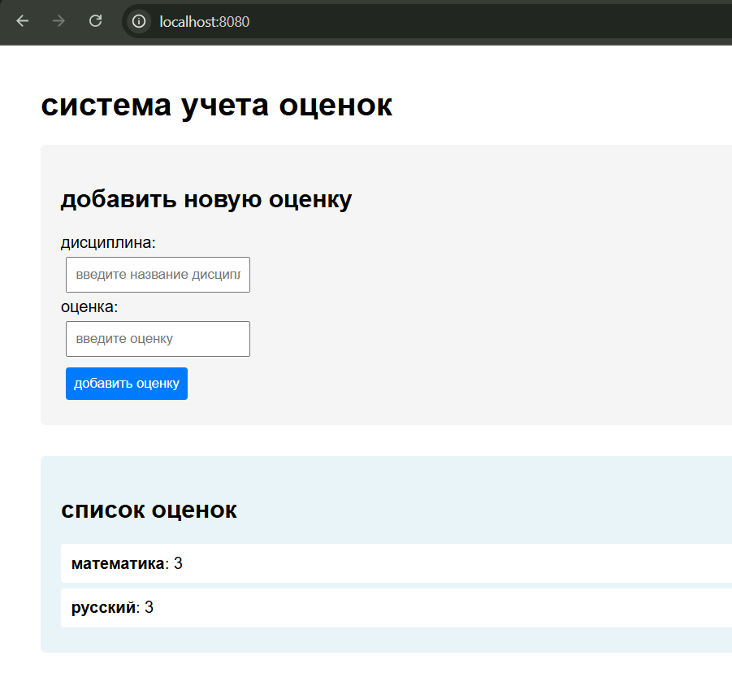
Проверка на верный ввод
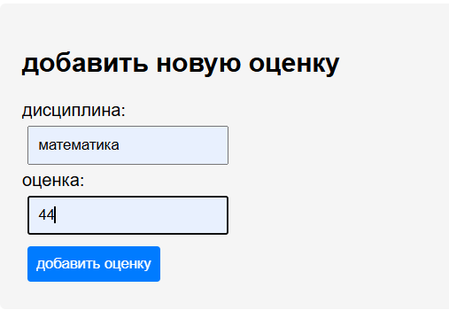
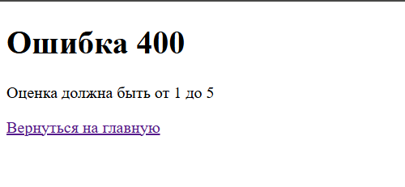
После возвращения на главную стр результат не проподает
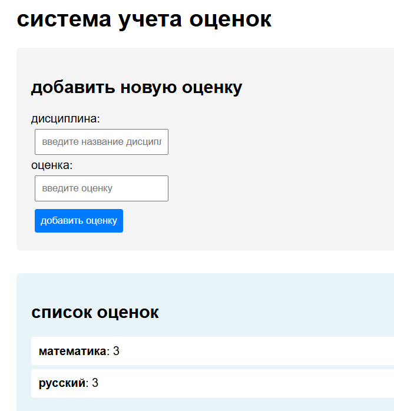

---

## Выводы

В ходе выполнения лабораторной работы были изучены основы работы с сокетами в Python:

1. **UDP-сокеты** - реализован простой обмен сообщениями между клиентом и сервером
2. **TCP-сокеты** - создан калькулятор для математических операций с обработкой различных вариантов заданий
3. **HTTP-сервер** - разработан базовый веб-сервер для отдачи статических HTML-страниц
4. **Многопользовательский чат** - реализован с использованием потоков для одновременной обработки множества клиентов
5. **Веб-приложение** - создан полноценный веб-сервер с обработкой GET и POST запросов, формами и валидацией данных

Все задания успешно выполнены с использованием библиотеки `socket` и соблюдением требований по протоколам. Многопользовательский чат и веб-сервер демонстрируют использование потоков (`threading`) для обработки множественных подключений.

Полученные навыки работы с сокетами являются фундаментальными для понимания сетевого программирования и разработки распределенных приложений.
